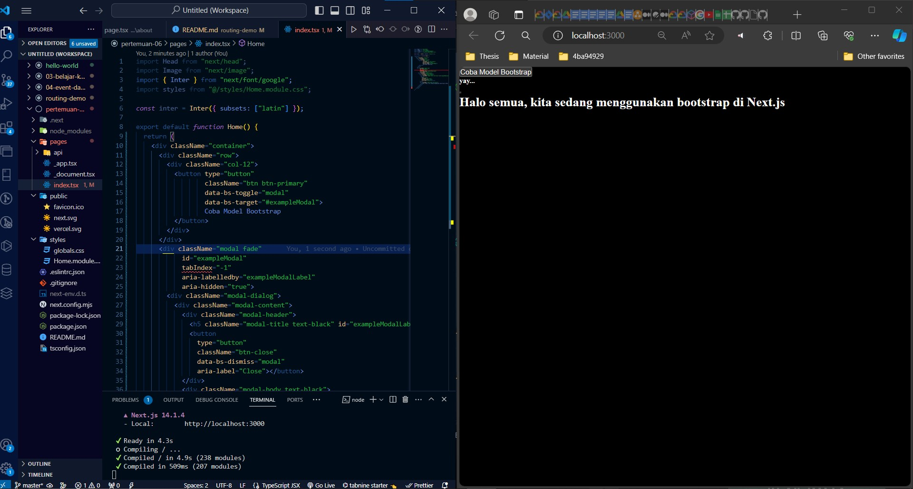
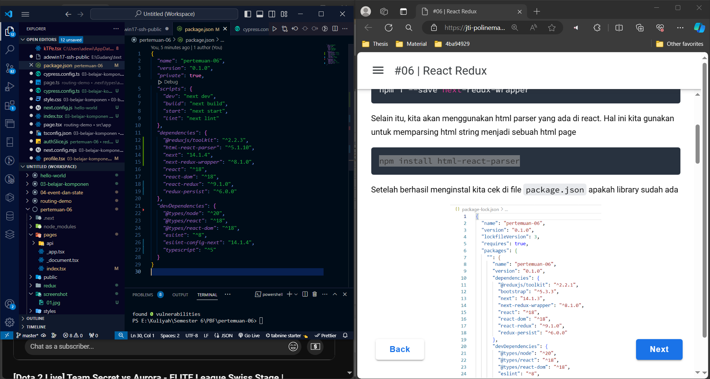
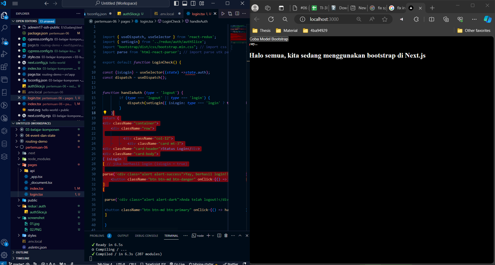

|  | Profile |
|--|--|
| NIM |  2141720165|
| Name | Vinsensius Ade Winata|
| Class | TI - 3I |

1. From the code provided, when accessing http://localhost:3000/login and clicking the login button, the state isLogin will be changed to true or false depending on whether the user has logged in or logged out. Then, depending on the value of isLogin, the appropriate message and corresponding button will be displayed.

When refreshing the page many times, the login status will remain persistent in the Redux store because the Redux store stores the state globally. So, even if we refresh the page, the isLogin value will remain and the view will be updated according to the isLogin value stored in the Redux store.

About the use of parse() in lines 25 and 30, it is used to parse the HTML string into valid HTML elements. If you do not use parse(), then the given HTML string will be displayed as plain text. Using parse(), you can insert HTML elements into a JSX React structure. So, without parse(), HTML strings will just be displayed as plain text without being interpreted as HTML elements by React.
