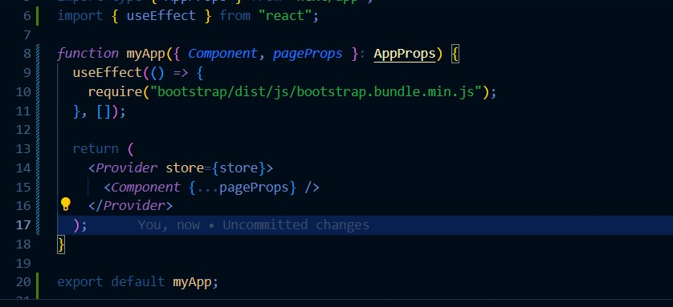

|  | Profile |
|--|--|
| NIM |  2141720165|
| Name | Vinsensius Ade Winata|
| Class | TI - 3I |

Practicum 1

https://drive.google.com/file/d/1aWp94cRLW9Bi23d0CQD78aNdEQWJjZ_S/view?usp=drive_link

https://drive.google.com/file/d/1F1tm7uG_rMCi47TzxvvcydCKsjjW9Uzt/view?usp=drive_link

https://drive.google.com/file/d/1xPvLoD7pujzSas6jH6vKKhSIR3bkkwR3/view?usp=drive_link

https://drive.google.com/file/d/11cmZm1HkhgTfVTqogYqUP_5UU0woYyBw/view?usp=drive_link
Modal is still Not working 

https://drive.google.com/file/d/12k45BwCHX_HIgd7GMbPP2qSHFusWwWPz/view?usp=drive_link

Modal is Working!

Practicum 2
 From the code provided, when accessing http://localhost:3000/login and clicking the login button, the state isLogin will be changed to true or false depending on whether the user has logged in or logged out. Then, depending on the value of isLogin, the appropriate message and corresponding button will be displayed.

https://drive.google.com/file/d/1JC5BlLxsE6py6mpZytryNi2_M5uY3ffq/view?usp=drive_link

https://drive.google.com/file/d/1rDwjJEObxyZAVx0L_Tlqf_VPFFzkxVIk/view?usp=drive_link

a.
When you refresh the page multiple times after logging in, there may be inconsistencies in the login state between the server and the client. This can be caused by several factors, for example:

1. Handling of login status on client and server side is inconsistent.
2. The login state stored on the client side is lost or out of sync with the state on the server side.
3. Differences in the rendering process during server-side and client-side hydration.

b. About the use of parse() in lines 25 and 30, it is used to parse the HTML string into valid HTML elements. If you do not use parse(), then the given HTML string will be displayed as plain text. Using parse(), you can insert HTML elements into a JSX React structure. So, without parse(), HTML strings will just be displayed as plain text without being interpreted as HTML elements by React.

https://drive.google.com/file/d/1fXEfFeuZ5hXVv0xa6mN0hiE5W7isGOpp/view?usp=drive_link
3. Counter is working!

Pertanyaan Praktikum

1. useEffect from "react" enables the utilization of lifecycle methods in React function components, allowing for side effects like data fetching or DOM manipulation. In the given code, it fetches configuration data for Bootstrap styles.
2. Removing useEffect in _app.tsx halts the data fetching process, resulting in missing configuration data for Bootstrap. This could lead to incorrect rendering or errors due to missing styles and configurations.
3. JSX in React/Next.js requires replacing HTML attributes like class with className to avoid conflicts with JavaScript's reserved keyword class.
4. Yes, store.js in Next.js can handle multiple Redux reducers by combining them with Redux's combineReducers function, organizing different parts of the application state.
5. store.js acts as the central hub for Redux state management in Next.js, creating the Redux store, combining reducers, configuring middleware, and handling initialization logic.
6. In login.tsx, useSelector extracts the isLogin state from the Redux store's auth slice, commonly used for conditional rendering based on authentication status.
7. In counter.tsx, useSelector extracts the totalCounter state from the Redux store's counter slice, allowing access and utilization of the counter value within the component.
